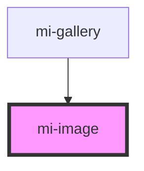

# mi-image

<!-- Auto Generated Below -->

## Properties

| Property      | Attribute     | Description | Type     | Default     |
| ------------- | ------------- | ----------- | -------- | ----------- |
| `description` | `description` |             | `string` | `undefined` |
| `heading`     | `heading`     |             | `string` | `undefined` |
| `image`       | `image`       |             | `string` | `undefined` |

## Events

| Event       | Description | Type               |
| ----------- | ----------- | ------------------ |
| `selection` |             | `CustomEvent<any>` |

## Dependencies

### Used by

 - [mi-gallery](../image-gallery-component)

### Graph

----------------------------------------------

*Built with [StencilJS](https://stenciljs.com/)*
