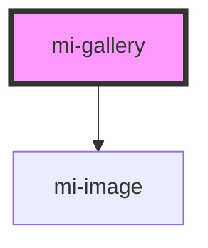

# mi-gallery

<!-- Auto Generated Below -->

## Properties

| Property | Attribute | Description | Type    | Default     |
| -------- | --------- | ----------- | ------- | ----------- |
| `items`  | --        |             | `any[]` | `undefined` |

## Dependencies

### Depends on

- [mi-image](../image-component)

### Graph

----------------------------------------------

*Built with [StencilJS](https://stenciljs.com/)*
